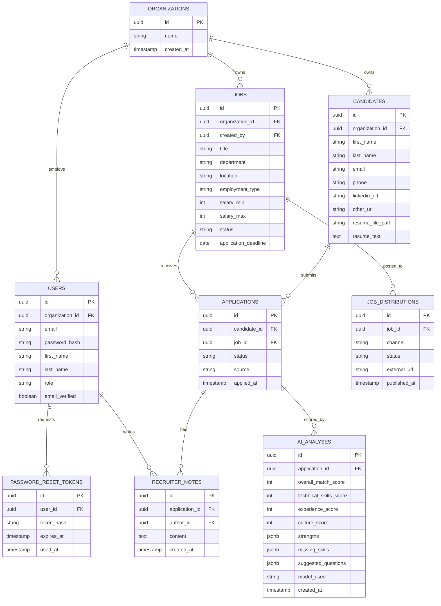

# TalentLens — Entity-Relationship Diagram & Schema

> Renders automatically on GitHub (mermaid `erDiagram` support built into GitHub's
> markdown viewer). If viewing elsewhere, paste the block into https://mermaid.live



## Relationship Notes

- `organizations` is the tenant root — every `users`, `jobs`, and `candidates` row is
  scoped to exactly one organization. All queries filter on `organization_id`
  server-side to enforce data isolation between companies.
- `jobs` and `candidates` connect through `applications` — a many-to-many
  relationship. A candidate can apply to multiple jobs; a job can receive many
  applications.
- `ai_analyses` is versioned: one `application` can have many analyses over time.
  The "current" score is the row with the latest `created_at` for that
  `application_id`.
- `job_distributions` is a v2 feature (publish job to LinkedIn/Internshala/etc as a
  stub) — one row per `(job_id, channel)` pair.

## Full SQL Schema

```sql
CREATE TABLE organizations (
    id          UUID PRIMARY KEY DEFAULT gen_random_uuid(),
    name        VARCHAR(255) NOT NULL,
    created_at  TIMESTAMPTZ NOT NULL DEFAULT now()
);

CREATE TABLE users (
    id              UUID PRIMARY KEY DEFAULT gen_random_uuid(),
    organization_id UUID NOT NULL REFERENCES organizations(id) ON DELETE CASCADE,
    email           VARCHAR(255) NOT NULL UNIQUE,
    password_hash   VARCHAR(255) NOT NULL,
    first_name      VARCHAR(100) NOT NULL,
    last_name       VARCHAR(100) NOT NULL,
    role            VARCHAR(20) NOT NULL DEFAULT 'recruiter'
                        CHECK (role IN ('admin', 'recruiter', 'viewer')),
    avatar_url      VARCHAR(500),
    email_verified  BOOLEAN NOT NULL DEFAULT false,
    created_at      TIMESTAMPTZ NOT NULL DEFAULT now(),
    updated_at      TIMESTAMPTZ NOT NULL DEFAULT now()
);
CREATE INDEX idx_users_organization_id ON users(organization_id);

CREATE TABLE password_reset_tokens (
    id          UUID PRIMARY KEY DEFAULT gen_random_uuid(),
    user_id     UUID NOT NULL REFERENCES users(id) ON DELETE CASCADE,
    token_hash  VARCHAR(255) NOT NULL,
    expires_at  TIMESTAMPTZ NOT NULL,
    used_at     TIMESTAMPTZ,
    created_at  TIMESTAMPTZ NOT NULL DEFAULT now()
);
CREATE INDEX idx_reset_tokens_user_id ON password_reset_tokens(user_id);

CREATE TABLE jobs (
    id                  UUID PRIMARY KEY DEFAULT gen_random_uuid(),
    organization_id     UUID NOT NULL REFERENCES organizations(id) ON DELETE CASCADE,
    created_by          UUID NOT NULL REFERENCES users(id),
    title               VARCHAR(255) NOT NULL,
    department          VARCHAR(100),
    location            VARCHAR(255),
    employment_type     VARCHAR(20) NOT NULL DEFAULT 'full-time'
                            CHECK (employment_type IN ('full-time','part-time','contract','internship')),
    years_experience     VARCHAR(50),
    salary_min          INTEGER,
    salary_max          INTEGER,
    description         TEXT,
    required_skills     TEXT[] DEFAULT '{}',
    preferred_skills    TEXT[] DEFAULT '{}',
    benefits            TEXT,
    status              VARCHAR(20) NOT NULL DEFAULT 'draft'
                            CHECK (status IN ('draft','active','closed')),
    application_deadline DATE,
    created_at          TIMESTAMPTZ NOT NULL DEFAULT now(),
    updated_at          TIMESTAMPTZ NOT NULL DEFAULT now()
);
CREATE INDEX idx_jobs_organization_id ON jobs(organization_id);
CREATE INDEX idx_jobs_status ON jobs(status);

CREATE TABLE candidates (
    id              UUID PRIMARY KEY DEFAULT gen_random_uuid(),
    organization_id UUID NOT NULL REFERENCES organizations(id) ON DELETE CASCADE,
    first_name      VARCHAR(100) NOT NULL,
    last_name       VARCHAR(100) NOT NULL,
    email           VARCHAR(255) NOT NULL,
    phone           VARCHAR(50),
    location        VARCHAR(255),
    linkedin_url    VARCHAR(500),
    other_url       VARCHAR(500),
    resume_file_path VARCHAR(500),
    resume_text     TEXT,
    skills          TEXT[] DEFAULT '{}',
    created_at      TIMESTAMPTZ NOT NULL DEFAULT now()
);
CREATE INDEX idx_candidates_organization_id ON candidates(organization_id);
CREATE UNIQUE INDEX idx_candidates_org_email ON candidates(organization_id, email);

CREATE TABLE applications (
    id           UUID PRIMARY KEY DEFAULT gen_random_uuid(),
    candidate_id UUID NOT NULL REFERENCES candidates(id) ON DELETE CASCADE,
    job_id       UUID NOT NULL REFERENCES jobs(id) ON DELETE CASCADE,
    status       VARCHAR(20) NOT NULL DEFAULT 'new'
                    CHECK (status IN ('new','screening','interview','offer','hired','rejected')),
    source       VARCHAR(50) DEFAULT 'manual',
    applied_at   TIMESTAMPTZ NOT NULL DEFAULT now(),
    updated_at   TIMESTAMPTZ NOT NULL DEFAULT now()
);
CREATE UNIQUE INDEX idx_applications_candidate_job ON applications(candidate_id, job_id);
CREATE INDEX idx_applications_job_id ON applications(job_id);
CREATE INDEX idx_applications_status ON applications(status);

CREATE TABLE ai_analyses (
    id                    UUID PRIMARY KEY DEFAULT gen_random_uuid(),
    application_id        UUID NOT NULL REFERENCES applications(id) ON DELETE CASCADE,
    overall_match_score   SMALLINT CHECK (overall_match_score BETWEEN 0 AND 100),
    technical_skills_score SMALLINT CHECK (technical_skills_score BETWEEN 0 AND 100),
    experience_score      SMALLINT CHECK (experience_score BETWEEN 0 AND 100),
    culture_score         SMALLINT CHECK (culture_score BETWEEN 0 AND 100),
    strengths             JSONB DEFAULT '[]',
    missing_skills        JSONB DEFAULT '[]',
    suggested_questions   JSONB DEFAULT '[]',
    model_used            VARCHAR(100),
    created_at            TIMESTAMPTZ NOT NULL DEFAULT now()
);
CREATE INDEX idx_ai_analyses_application_id ON ai_analyses(application_id);

CREATE TABLE recruiter_notes (
    id             UUID PRIMARY KEY DEFAULT gen_random_uuid(),
    application_id UUID NOT NULL REFERENCES applications(id) ON DELETE CASCADE,
    author_id      UUID NOT NULL REFERENCES users(id),
    content        TEXT NOT NULL,
    created_at     TIMESTAMPTZ NOT NULL DEFAULT now()
);
CREATE INDEX idx_recruiter_notes_application_id ON recruiter_notes(application_id);

CREATE TABLE job_distributions (
    id            UUID PRIMARY KEY DEFAULT gen_random_uuid(),
    job_id        UUID NOT NULL REFERENCES jobs(id) ON DELETE CASCADE,
    channel       VARCHAR(50) NOT NULL,
    status        VARCHAR(20) NOT NULL DEFAULT 'pending'
                    CHECK (status IN ('pending','published','failed')),
    external_url  VARCHAR(500),
    published_at  TIMESTAMPTZ,
    created_at    TIMESTAMPTZ NOT NULL DEFAULT now()
);
CREATE UNIQUE INDEX idx_job_distributions_job_channel ON job_distributions(job_id, channel);
```
